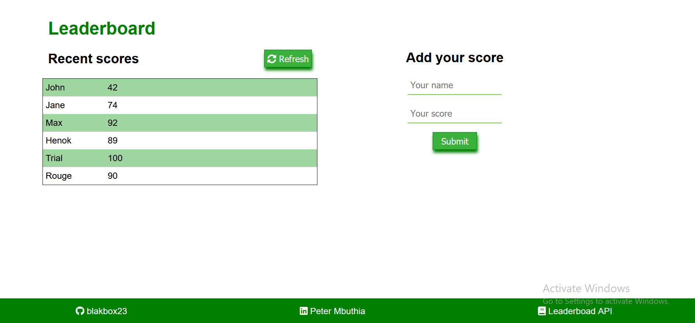

# Leaderboard
This project utilises the [leaderboard](https://www.notion.so/Leaderboard-API-service-24c0c3c116974ac49488d4eb0267ade3) API to store and retrieve player scores. 

A user can POST data by submitting their name and score on the app. They can then retrieve the stored data by hiting the refresh button which uses the GET method to get data through the API.
This project also uses webpack to bundlE JavaScript modules.

## Built with
- HTML
- CSS
- JavaScript

## Prerequisites
 -  Node.js
 -  NPM

## Setup

Clone the repository with:

`git clone https://github.com/blakbox23/Leaderboard.git`

## Install
To install dependancies run:

`npm install` 

## Usage
To use the application run.

`npm run start`

👤 **Author**

- GitHub: [@Blakbox23](https://github.com/blakbox23)
- Twitter: [@blakbox23](https://twitter.com/blakbox23)
- LinkedIn: [Peter Mbuthia](https://www.linkedin.com/in/peter-mbuthia)

## 🤝 Contributing

Contributions, issues, and feature requests are welcome!

Feel free to check the [issues page](https://github.com/blakbox23/Leaderboard/issues).

## Show your support

Give a ⭐️ if you like this project!

## Acknowledgments

- Hat tip to anyone whose code was used
- Microverse Inc

## 📝 License

This project is [MIT](./MIT.md) licensed.

